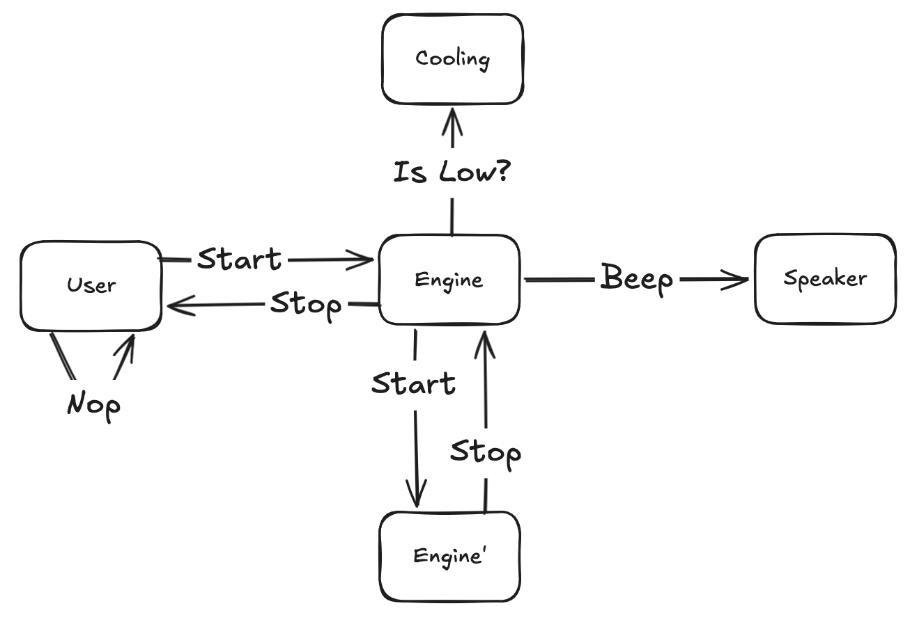
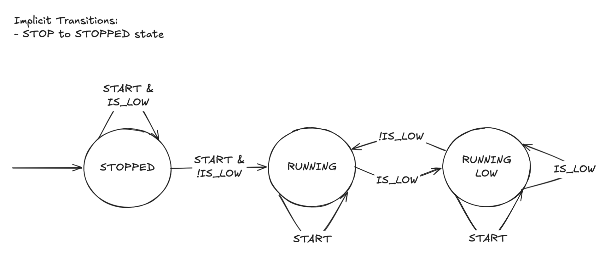

# Отчет по ЛР 2. Верификация моделей в SPIN

## Цели и задачи работы

> Температура двигателя поддерживается ниже предельного значения с помощью
> охлаждающего расходуемого агента. Когда количество охлаждающего агента
> приближается к критически малым значениям, то (1) при работающем двигателе,
> подаётся звуковой сигнал и, если двигатель не был выключен, через некоторое время
> система охлаждения отключает его, и (2) при работающем двигателе, подаётся
> звуковой сигнал при попытке пользователя завести двигатель и двигатель не
> запускается.

**Цели и задачи л/р**: Верифицировать с использованием верификатора моделей SPIN параллельную
систему из лабораторной работы №1.

**Для этого проделать следующие шаги**.

1. Записать спецификацию системы на входном языке SPIN.

2. Сформулировать 3 свойства системы на языке темпоральной логики LTL.

3. Провести верификацию этих свойств в SPIN. Требования к системе и системе и свойствам такие же как в лабораторной работе №1.

4. Провести сравнение методов моделирования и верификации в nuXmv и SPIN.

**Требования к выполнению лабораторной работе:**

1. Система и формальные записи свойств соответствует требованиям лабораторной работы.

2. Минимум 2 свойства выполняются при верификации. Если одно из свойств не выполняется, предоставить анализ ошибочной трассы и показать, что исправление ошибки ведёт к неприемлемой сложности системы.

## Ход работы

### Подготовка

В этот раз плагин для VSCode можно было не писать, так как уже был сносный
<https://marketplace.visualstudio.com/items?itemName=dsvictor94.promela>.

Ознакомился со следующими источниками:

1. <https://spinroot.com/spin/Doc/SpinTutorial.pdf>

2. <https://spinroot.com/spin/Doc/Spin_tutorial_2004.pdf>

### Объектная модель

- `User` хаотично вызывает `Start`, `Stop`

- `Engine` не дает `User` сломать систему

- `Engine'` делает, что ему говорят

- `Cooling` является датчиком объема реагента

- `Speaker` подает звуковой сигнал

### Система переходов Engine

### Исходный код

- [colden.pml](./colden.pml)

- [colden.sh](./colden.sh)
