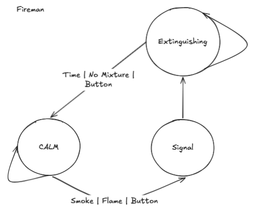

# Отчет по ЛР 4. Верификация моделей в PRISM

## Цели и задачи работы

> Подаётся звуковой сигнал, когда есть дым, пламя, нажата тревожная кнопка. После
> этого включается система пожаротушения, которая работает заданное время, или
> пока не закончится пожаротушительная смесь, или пока эту систему не отключат
> вручную.

**Цели и задачи л/р**: Верифицировать с использованием верификатора моделей PRISM вероятностную
параллельную систему из лабораторной работы №1.

**Для этого проделать следующие шаги.**

1. Ввести в систему элементы вероятности (например, установить вероятности действий пользователя/среды или некорректной работы датчиков).

2. Записать спецификацию системы на входном языке PRISM.

3. Сформулировать 3 свойства системы на языке какой-либо вероятностной темпоральной логики.

4. Провести верификацию этих свойств в PRISM. Требования к системе и системе и свойствам такие же как в лабораторной работе №1. Провести сравнение методов моделирования и верификации в nuXmv и PRISM.

**Требования к выполнению лабораторной работе:**

1. Система и формальные записи свойств соответствует требованиям лабораторной работы.

2. Минимум 2 свойства выполняются при верификации. Если одно из свойств не выполняется, предоставить анализ ошибочной трассы и показать, что исправление ошибки ведёт к неприемлемой сложности системы.

## Ход работы

### Изучение PRISM

- <https://www.prismmodelchecker.org/manual>

- <https://www.prismmodelchecker.org/tutorial>

### Система переходов

### Исходный код

- [fireman.prism](./fireman.prism)

- [fireman.props](./fireman.props)
